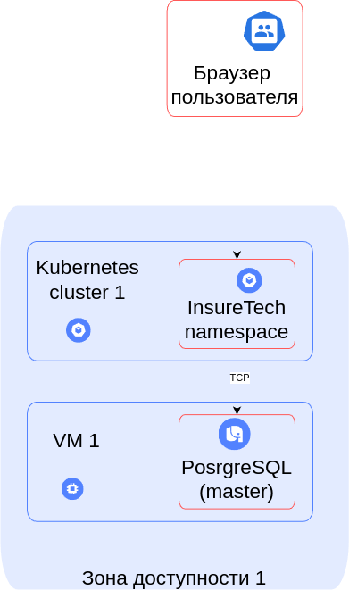
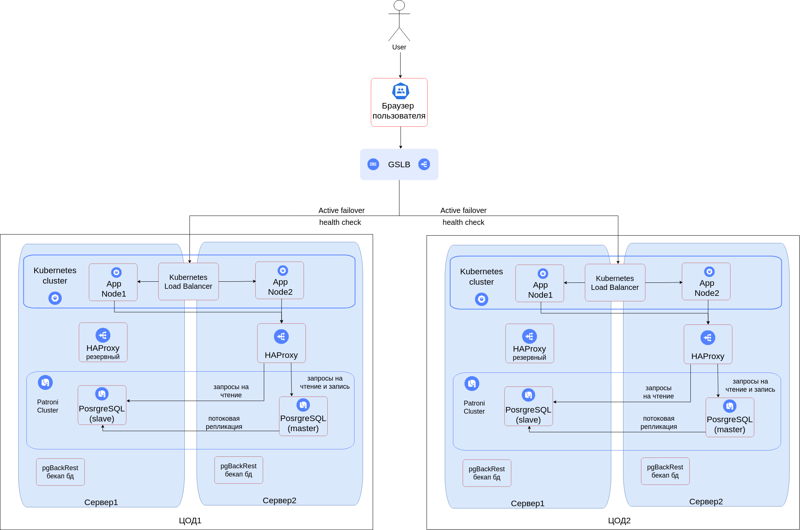

# Проектирование

## Оглавление

- [Проектирование технологической архитектуры](#проектирование-технологической-архитектуры)
- [Гео-распределенная архитектура](#гео-распределенная-архитектура)
  - [Изначальная схема](#изначальная-схема)
  - [Схема итогового решения](#схема-итогового-решения)

## Проектирование технологической архитектуры

Компания хочет сделать упор на развитие в регионах РФ. Планируется значительный рост количества пользователей и запросов.
Нужно обеспечить бесперебойную работу сервиса 24/7, при этом сервис должен обслуживать клиентов из всех часовых поясов.

Требования:

- RTO(Recovery Time Objective) — максимальное время недоступности инфраструктуры 45 мин;
- RPO(Recovery Point Objective) — допускается потеря данных не более чем за последние 15 мин;
- Доступность приложения должна быть равна 99,9%;
- Обеспечить одинаковое время загрузки страниц для пользователей из разных регионв,
оно не должно зависеть от географического местоположения пользователя;

Дополнительно к этому нужно обеспечить одинаковое время загрузки страниц для пользователей из разных регионов.

Оно не должно зависеть от географического местоположения пользователя.

На текущий момент сервис хранит ограниченный набор данных, который включает в себя:

- базовую информацию о клиентах — ФИО, контакты, документы,
- информацию о продуктах и тарифах,
- историю заявок клиентов.

Общий объём данных, которые хранятся в системе, равен 50 GB.

## Разработка решения

Есть два основных типа failover(аварийное переключение)-стратегии:

- Active-Active - приложение разворачивается как минимум на двух серверах, и трафик идет на все;
- Active-Standby(Passive) - приложение разворачивается как минимум на двух серверах, при этом трафик идет на один сервер, второй - находится в режиме ожидания с минимальной утилизацией ресурсов на случай отказа первого.

- Для требования доступности приложения 99,9% подходит статегия Active-Active, поскольку Active-Passive стратегия имее более низкую доступность по причине задержки, связанной с активацией резервного сервера.
- Для балансировки нагрузки между разными ЦОДами, которые находятся в разных географических зонах, используется Global Server Load Balancer(GSLB) с георезервированием.  
- Для обеспечения отказоустойчивости и высокой доступности приложения применяется распределенный кластер Kubernetes с горизонтальным масштабированием и с встроенным балансировщиком нагрузки.
- Для обеспечения отказоустойчивости и высокой доступности БД применяется распределенный кластер PostgreSql на основе Patroni с горизонтальным масштабированимем.
- Подключение к кластеру БД осуществляется через балансировщик HAProxy, который определяет master ноду через обращение на API Patroni.
- HAProxy также разворачивается в резервной конфигурации.  

## Гео-распределенная архитектура

### Изначальная схема

### Схема итогового решения

[<- На главную страницу](../ReadMe.md)
