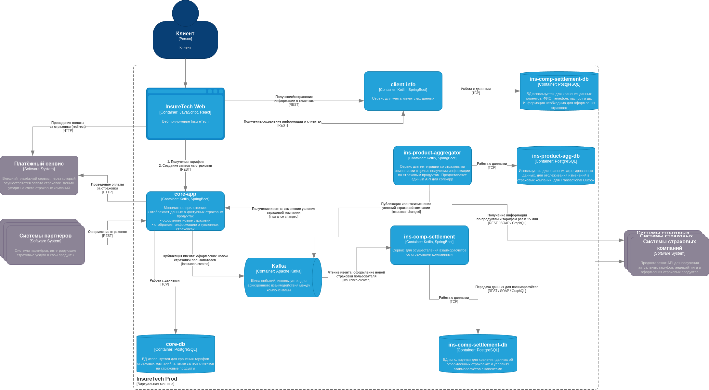
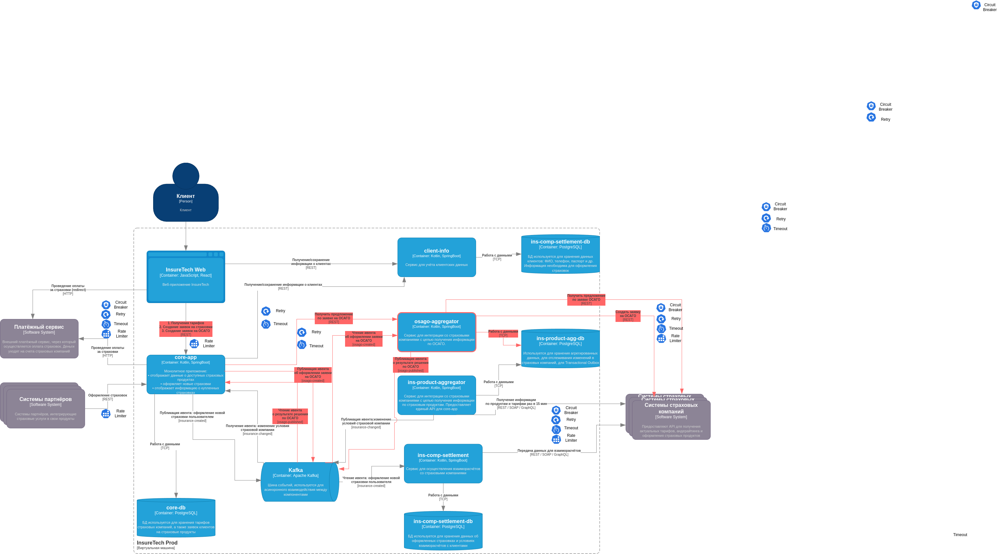

# Продажи ОСАГО

## Оглавление

- [Проектирование продажи ОСАГО](#проектирование-продажи-осаго)
- [Решение](#решение)
- [Диаграмма компонентов системы as-is](#диаграмма-компонентов-системы-as-is)
- [Диаграмма компонентов системы to-be](#диаграмма-компонентов-системы-to-be)

## Проектирование продажи ОСАГО

Компания планирует вскоре запустить новый продукт: оформление ОСАГО онлайн.
Пользовательский путь выглядит так:

- клиенту предлагается заполнить заявку с информацией о своём автомобиле,
после этого сервис запрашивает у всех доступных страховых компаний предложения с условиями страхования под заявку клиента.
- Бизнесу важно, чтобы на экране пользователя предложения от каждой страховой компании отображались сразу,
как только от неё пришёл ответ. Максимальное время ожидания решения от страховой компании — 60 секунд.

Все страховые компании предоставляют однотипные REST API с двумя эндпоинтами:

- создать заявку на ОСАГО,
- получить предложение по заявке.

Бизнес предполагает, что в пик нагрузки количество одновременных пользователей, создающих заявку на ОСАГО, может достигать 2,5 тысячи человек.

Вы обсудили задачу с командой разработки и приняли такие решения:

1. Сохранить подход, который использовался для получения данных о продуктах и тарифах из страховых компаний.
2. Выделить отдельный сервис для взаимодействия со страховыми компаниями — osago-aggregator.

Функциональная обязанность этого сервиса — отправка заявок в страховые компании и дальнейший опрос решений по ним для передачи результатов в core-app.
Остальная функциональность, связанная с оформлением ОСАГО, остаётся на стороне бэкенда в core-app.

Теперь вам нужно проработать ещё несколько моментов, исходя из требований бизнеса. Доработайте схему, которая у вас получилась в третьем задании.
Отразите на ней ваши решения по этим вопросам:

1. Проработайте реализацию osago-aggregator. Решите:
2. Требуется ли ему своё хранилище данных?
3. Какой API он предоставляет core-app?
4. Определите средство интеграции между сервисами core-app и osago-aggregator.
5. Подумайте над API для веб-приложения в core-app.
6. Определите средство интеграции между веб-приложением и core-app. Если будете использовать средство, отличное от REST, отразите интеграцию новой стрелкой.
7. В зависимости от выбранных средств интеграции подумайте, требуется ли где-то применение паттернов отказоустойчивости:
   - Rate Limiting
   - Circuit Breaker
   - Retry
   - Timeout
   - Outbox Transactional

8. Примите во внимание, что сервисы задеплоены в нескольких экземплярах. Подумайте, зависит ли ваше решение от этого.

Загрузите новый вариант схемы в директорию Task4 в рамках пул-реквеста.

## Решение

1. **_Требуется ли для osago-aggregator своё хранилище данных?:_**
   Думаю, имеет смысл использовать в качестве хранилища то же самое, что уже использует ins-product-aggregator.
   Так мы сможем точно понимать, когда произошло изменение в данных страховых компаний,
   не отправляя в очередь ивент, который не изменяет условий.
   Также это хранилище я бы использовал для реализации паттерна Transactional Outbox,
   поскольку для нас критично не упустить изменения в условиях страхового полиса.
   Кроме того, благодаря данному хранилищу мы могли бы проводить аудит изменений страховых планов.

2. **_Какой API он предоставляет core-app?:_**
   Cинхронный REST, чтобы гарантировать ответ в 60 сек, а оформление ОСАГО - асинхронный через Kafka.

3. _**Определите средство интеграции между сервисами core-app и osago-aggregator:**_
   Был выбран точка-точка, так как события в топиках для ОСАГО от core-app предназначены только для osago-aggregator сервиса.

4. _**Подумайте над API для веб-приложения в core-app:**_
   REST, клиент делает сетевые запросы.

5. _**Определите средство интеграции между веб-приложением и core-app. Если будете использовать средство, отличное от REST, отразите интеграцию новой стрелкой:**_
   Буду использовать REST.

6. **_Rate Limiting:_**
   Так как мы ходим во внешние системы, к операторам страховок, то было бы неплохо гарантировать кол-во запросов,
   которые от нас исходят, чтобы не навредить партнёрам, а также, чтобы не израсходовать много ресурсов на избыточные запросы.
   Также используем для защиты своей системы, когда партнёры ходят к нам, также защитим core-app от клиента.

7. _**Circuit Breaker:**_
   Используем, чтобы не ходить во внешние системы, когда они недоступны.

8. _**Retry:**_
   Использовал бы при любом синхронном взаимодействии, единственное, нужно будет предусмотреть передачу и обработку уникального ключа для идемпотентности.

9. _**Timeout*:*_
   Для гарантии 60 сек ответа от страховых компаний, если нет ответа, то своему пользователю вернем заглушку/ошибку/дефолтное значение.
   Также используем во взаимодействии между своими сервисами, чтобы не стучаться в упавший сервис.

10. _**Outbox Transactional:**_
    Используем паттерн при любом событии, в хранилищах каждого сервиса создаём по таблице `outbox`,
    паттерн даст гарантию доставки сообщений, `at least once`, опять же предусмотрим использование уникального ключа для идемпотентности.

11. **_Примите во внимание, что сервисы задеплоены в нескольких экземплярах. Подумайте, зависит ли ваше решение от этого:_**
    Думаю, что стоит использовать уникальный ключ каждого события для идемпотентности и корректной обработки событий и запросов разными инстансами сервисов.

## Диаграмма компонентов системы as-is

## Диаграмма компонентов системы to-be

[<- На главную страницу](../ReadMe.md)
